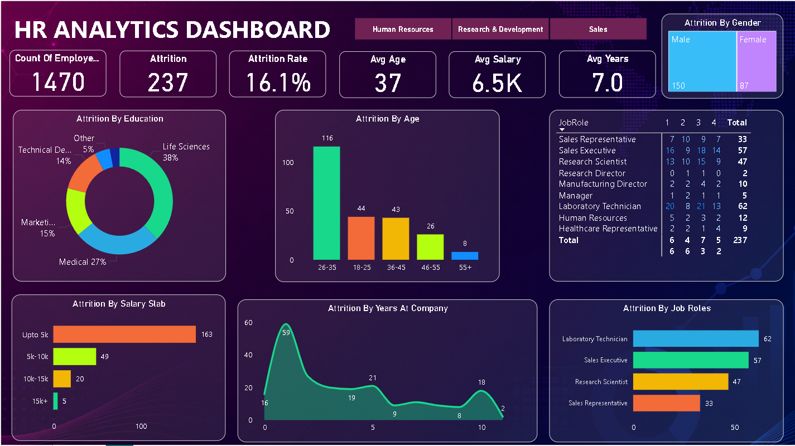

```markdown
# HR Analytics Dashboard

### 1. Project Title / Headline
An interactive Power BI based HR analytics dashboard built to
analyze workforce metrics, employee attrition rates, salary distribution,
demographics, job roles, educational background, and tenure patterns.

### 2. Short Description / Purpose
The HR Analytics Dashboard provides a clear view of
1,470 total employees across key operational metrics and attrition drivers.

It helps analyze

total employee count

attrition volume and attrition rate %

average employee age, salary, and tenure years

attrition breakdown by gender and education field

attrition trends by age group and salary slab

attrition distribution by job role and years at company.

### 3. Tech Stack
Power BI Desktop – Visualizations, DAX measures, and report design

Power Query – Data extraction, transformation, and loading (ETL)

DAX (Data Analysis Expressions) – Custom measures and calculations

Interactive Slicers & Page Filters – Dynamic user filtering

Dashboard Design & Data Visualization

### 4. Data Set
The project uses an HR attrition analytics dataset
containing records of 1,470 employees across multiple organizational departments.

Key columns include:

Department (Human Resources, Research & Development, Sales)

Attrition Status (Yes, No)

Employee Demographics (Age, Age Group, Gender)

Educational Background (Life Sciences, Medical, Marketing, Technical Degree, Other)

Job Role & Job Level (Sales Executive, Laboratory Technician, Research Scientist, etc.)

Monthly Income & Salary Slab (Upto 5k, 5k-10k, 10k-15k, 15k+)

Years at Company & Total Working Years

### 5. Features / Highlights

• Business Problem
HR executives and talent management teams struggle to identify the root causes of employee turnover, compensation disparities, and department-specific attrition patterns directly from large raw employee databases.

Key questions such as:
- What is the overall attrition rate, and which age groups or salary slabs suffer from the highest turnover?
- How does employee attrition vary across different education fields and job roles?
- Does tenure length impact employee retention?
...are difficult to answer quickly without unified interactive analytics.

• Goal of the Dashboard
To deliver an interactive visual tool that:
- Tracks key HR metrics (Count of Employees, Attrition, Attrition Rate %, Avg Age, Avg Salary, Avg Years)
- Uncovers attrition drivers across demographics, education, salary bands, and job roles
- Supports workforce decision-making in retention strategies, compensation adjustments, and targeted hiring planning.

• Walkthrough of Key Visuals
- Key KPIs
  - Count Of Employee: 1,470
  - Attrition: 237
  - Attrition Rate: 16.1%
  - Avg Age: 37
  - Avg Salary: 6.5K
  - Avg Years: 7.0
- Filter Panel
  Interactive department buttons enable dynamic filtering across Human Resources, Research & Development, and Sales.
- Attrition By Gender (Treemap Visual)
  Displays gender breakdown among departed employees: Male accounts for 150 employees, while Female accounts for 87 employees.
- Attrition By Education (Donut Chart)
  Highlights educational field breakdown: Life Sciences (38%), Medical (27%), Marketing (15%), Technical Degree (14%), and Other (5%).
- Attrition By Age (Column Chart)
  Ranks attrition by age bracket: 26-35 (116 employees), 18-25 (44), 36-45 (43), 46-55 (26), and 55+ (8).
- Job Role & Job Level Attrition Breakdown (Data Matrix)
  Displays detailed attrition breakdown across job roles (Laboratory Technician, Sales Executive, Research Scientist, etc.) by job level satisfaction matrix.
- Attrition By Salary Slab (Horizontal Bar Chart)
  Shows turnover across income tiers: Upto 5k (163 employees), 5k-10k (49), 10k-15k (20), and 15k+ (5).
- Attrition By Years At Company (Area Line Chart)
  Illustrates turnover trajectory by tenure years, highlighting peak attrition during initial tenure years (peaking at 59 employees around year 1-2).
- Attrition By Job Roles (Horizontal Bar Chart)
  Ranks leading roles impacted by attrition: Laboratory Technician (62), Sales Executive (57), Research Scientist (47), and Sales Representative (33).

### 6. Screenshots / Demos


```
